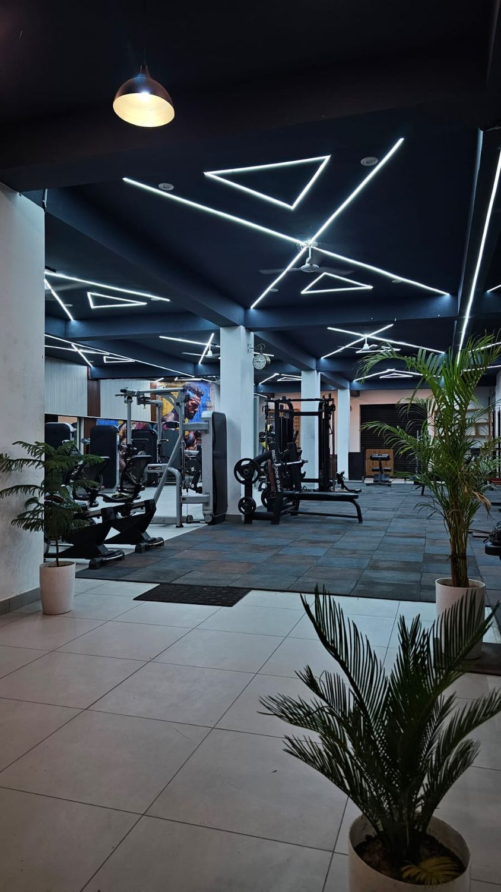

# Inshape Fitness — Landing Page

A world-class, responsive landing page for **Inshape Fitness**, a premium strength & fitness studio in **Bharatpur, Rajasthan, India**.



## ✨ Features

- Full-screen cinematic hero with real gym photography
- Sticky navigation + mobile slide-in menu
- Animated stat counters and scroll-reveal animations
- Sections: About, Programs, "Step Inside" photo gallery, Trainers, Membership pricing (₹ INR), Facilities, CTA, Location + map, Contact
- High-energy premium aesthetic — bold display type, dark theme, orange accent
- Lightweight `index.html` (HTML + CSS + vanilla JS, no build step) with all images stored as separate files in `assets/`

## 📁 Structure

```
inshape-fitness/
├── index.html          # the landing page
├── README.md
└── assets/             # all photography, one file per image
    ├── hero.svg
    ├── about-lounge.svg
    ├── gallery-cardio.svg
    ├── gallery-strength.svg
    ├── gallery-reception.svg
    ├── program-strength.svg
    ├── program-hiit.svg
    ├── program-pt.svg
    ├── program-functional.svg
    ├── cta-banner.svg
    ├── trainer-1.svg
    ├── trainer-2.svg
    └── trainer-3.svg
```

> **Note on the image files:** each photo is stored as an individual, optimized image file in `assets/` (SVG-wrapped so it renders natively in the browser and on GitHub Pages). `index.html` references them with relative `assets/…` paths, so the site is fully self-contained — no external dependencies except the Google Maps embed in the Location section.

## 🚀 Run locally

Open `index.html` in your browser, or serve it:

```bash
python3 -m http.server 8000
# then visit http://localhost:8000
```

## 🌐 Deploy with GitHub Pages (free)

1. Go to **Settings → Pages**
2. Under **Source**, choose the `main` branch and `/ (root)` folder, then **Save**
3. Your site goes live at:
   `https://sainihiteshscientist-gif.github.io/inshape-fitness/`

## 🖊️ Before going live — customize these placeholders

- 📞 Phone / WhatsApp number
- 📍 Exact address + PIN code
- ✉️ Email and social media links
- 💳 Membership prices
- 🕒 Opening hours, trainer names, and the headline stats

---

Get In Shape. Stay Inshape. — Bharatpur, Rajasthan 🇮🇳
